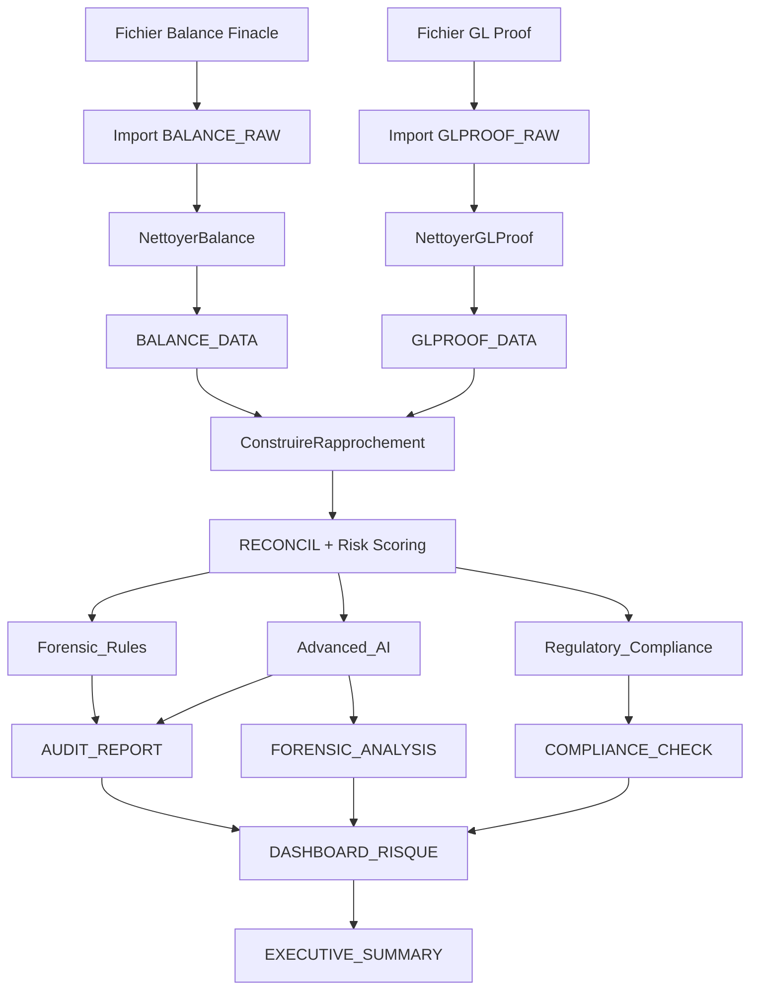

# 📄 PRODUCT REQUIREMENTS DOCUMENT (PRD)

**Nom du Produit :** S.A.F.A (System for Automated Financial Audit)
**Version :** 10.0 (Enhanced)
**Dernière Mise à jour :** Décembre 2024
**Statut :** Production Ready

---

## 1. VISION & OBJECTIFS

### 1.1 Vision

Transformer le processus manuel, lent et risqué de réconciliation bancaire (Balance vs GL Proof) en une opération "One-Click", sécurisée et augmentée par des analyses forensiques, statistiques (IA) et des contrôles de conformité réglementaire automatisés.

### 1.2 Objectifs Principaux (KPIs)

| KPI | Objectif | Métrique |
|-----|----------|----------|
| **Vitesse** | Réduire le temps de traitement | De 4 heures à < 2 minutes |
| **Fiabilité** | Éliminer les erreurs de conversion | 100% de précision |
| **Détection** | Identifier automatiquement les fraudes | Benford, Structuring, Z-Score |
| **Conformité** | Vérifier les règles réglementaires | COBAC, OHADA, LAB/FT |
| **Stabilité** | Fonctionner sans crash | Excel 32-bit et 64-bit |

---

## 2. PERSONAS UTILISATEURS

### 2.1 L'Auditeur Interne (Junior/Senior)
- **Besoin :** Automatiser la "corvée" de rapprochement
- **Attente :** Interface simple, pas de code
- **Valeur :** Se concentrer sur l'analyse, pas la saisie

### 2.2 Le Chef de Mission
- **Besoin :** Dashboard synthétique (KPIs)
- **Attente :** Assurance que les données sont intègres
- **Valeur :** Vue consolidée des risques

### 2.3 Le Risk Manager / Compliance Officer
- **Besoin :** Analyses forensiques et contrôles de conformité
- **Attente :** Alertes automatiques sur les anomalies
- **Valeur :** Détection proactive des fraudes

### 2.4 La Direction Générale
- **Besoin :** Executive Summary
- **Attente :** Rapport prêt à signer
- **Valeur :** Prise de décision rapide

---

## 3. ARCHITECTURE FONCTIONNELLE v10.0

### 3.1 Core Engine (Moteur Principal)

```
┌─────────────────────────────────────────────────────────────┐
│                      CORE_ENGINE v10.0                       │
├─────────────────────────────────────────────────────────────┤
│  ┌──────────────┐  ┌──────────────┐  ┌──────────────────┐  │
│  │  SafeVal()   │  │  SafeText()  │  │  SafeDate()      │  │
│  │  Bulldozer   │  │  Nettoyeur   │  │  Multi-format    │  │
│  └──────────────┘  └──────────────┘  └──────────────────┘  │
│                                                              │
│  ┌──────────────────────────────────────────────────────┐  │
│  │              DATA INGESTION                           │  │
│  │  • Parser Finacle intelligent (scan 50 lignes)       │  │
│  │  • Support multi-devises (XAF, EUR, USD, XOF...)     │  │
│  │  • Détection automatique des formats                  │  │
│  └──────────────────────────────────────────────────────┘  │
│                                                              │
│  ┌──────────────────────────────────────────────────────┐  │
│  │              MATCHING ENGINE                          │  │
│  │  • Clé de lettrage normalisée (SOL ID injection)     │  │
│  │  • Tolérance paramétrable                             │  │
│  │  • Détection orphelins (GL Only / Balance Only)      │  │
│  └──────────────────────────────────────────────────────┘  │
│                                                              │
│  ┌──────────────────────────────────────────────────────┐  │
│  │              RISK SCORING ENGINE                      │  │
│  │  • Score 0-100 pondéré                                │  │
│  │  • Facteurs: Montant, Age, Orphelin, Volume           │  │
│  │  • Classification: CRITICAL, HIGH, MEDIUM, LOW        │  │
│  └──────────────────────────────────────────────────────┘  │
└─────────────────────────────────────────────────────────────┘
```

### 3.2 Forensic Rules (Détection de Fraudes)

| Règle | Description | Sévérité |
|-------|-------------|----------|
| **FRD-001** | Mots-clés suspects (CADEAU, URGENT, MANUEL...) | FRAUD |
| **FRD-002** | Transactions week-end > 50K | COMPLIANCE |
| **FRD-003** | Juste sous seuil réglementaire | FRAUD |
| **FRD-004** | Circularité / Layering (4+ transactions identiques) | CRITICAL |
| **FRD-005** | Saucissonnage / Structuring (3+ le même jour) | FRAUD |
| **FRD-006** | Transactions en double (même hash) | HIGH |
| **FRD-007** | Pattern répétitif (5+ même montant rond) | FRAUD |
| **FRD-008** | Concentration fin de mois (10+ transactions) | MEDIUM |
| **BEN-001** | Non-conformité Benford (MAD > 0.015) | CRITICAL |

### 3.3 Advanced AI (Intelligence Artificielle)

```
┌─────────────────────────────────────────────────────────────┐
│                     ADVANCED_AI v10.0                        │
├─────────────────────────────────────────────────────────────┤
│                                                              │
│  ┌──────────────────────────────────────────────────────┐  │
│  │              Z-SCORE ANALYSIS                         │  │
│  │  • Calcul statistique par compte                      │  │
│  │  • Seuil warning: Z > 2.5                            │  │
│  │  • Seuil critique: Z > 3.5                           │  │
│  │  • Minimum 5 transactions pour analyse                │  │
│  └──────────────────────────────────────────────────────┘  │
│                                                              │
│  ┌──────────────────────────────────────────────────────┐  │
│  │              VELOCITY ANALYSIS                        │  │
│  │  • Comparaison avec historique                        │  │
│  │  • Détection explosion écart (> 50%)                  │  │
│  │  • Tendance: HAUSSE / BAISSE / STABLE                 │  │
│  └──────────────────────────────────────────────────────┘  │
│                                                              │
│  ┌──────────────────────────────────────────────────────┐  │
│  │              BENFORD ANALYSIS (Enhanced)              │  │
│  │  • Chi-squared test (seuil: 15.51)                   │  │
│  │  • MAD calculation (Mean Absolute Deviation)          │  │
│  │  • Graphique comparatif automatique                   │  │
│  └──────────────────────────────────────────────────────┘  │
│                                                              │
│  ┌──────────────────────────────────────────────────────┐  │
│  │              DORMANCY DETECTION                       │  │
│  │  • Comptes avec peu d'historique + gros volumes       │  │
│  │  • Réveil soudain de comptes dormants                 │  │
│  └──────────────────────────────────────────────────────┘  │
│                                                              │
└─────────────────────────────────────────────────────────────┘
```

### 3.4 Regulatory Compliance (Conformité Réglementaire)

| Réglementation | Vérification | Seuil |
|----------------|--------------|-------|
| **COBAC R-2001/01** | Suspens > 90 jours | 90 jours |
| **COBAC Transit** | Comptes de passage non apurés | J+7 |
| **COBAC/IFRS9** | Couverture provisions | > 50% |
| **OHADA Art.7** | Équilibre bilan (Actif = Passif) | Écart < 1000 |
| **SYSCOHADA** | Cohérence sens des comptes | Par classe |
| **LAB/FT** | Transactions > seuil déclaration | 5M XAF |
| **LAB/FT** | Détection structuration | Pattern |
| **Prudentiel** | Concentration des risques | < 25% |

---

## 4. ARCHITECTURE TECHNIQUE

### 4.1 Structure des Modules

```
S.A.F.A v10.0/
│
├── src/
│   ├── vba/
│   │   ├── Core_Engine.bas        # Moteur principal (1200+ lignes)
│   │   ├── Forensic_Rules.bas     # Détection fraudes (800+ lignes)
│   │   ├── Advanced_AI.bas        # IA & Statistiques (600+ lignes)
│   │   ├── Regulatory_Compliance.bas # Conformité (500+ lignes)
│   │   └── ThisWorkbook.cls       # Événements classeur
│   │
│   ├── forms/
│   │   └── USF_Cockpit.frm        # Interface principale
│   │
│   └── classes/
│       └── (Extensible)
│
├── config/
│   ├── settings.json              # Configuration générale
│   └── fraud_keywords.json        # Mots-clés suspects
│
└── docs/
    ├── PRD.md                     # Ce document
    ├── USER_GUIDE.md              # Guide utilisateur
    └── TECHNICAL_SPEC.md          # Spécifications techniques
```

### 4.2 Flux de Données



---

## 5. NOUVELLES FONCTIONNALITÉS v10.0

### 5.1 Par rapport à v9.0

| Fonctionnalité | v9.0 | v10.0 |
|----------------|------|-------|
| Risk Scoring | ❌ | ✅ Score 0-100 pondéré |
| Benford Analysis | Basique | ✅ Chi² + MAD + Graphique |
| Audit Trail | ❌ | ✅ Hash sécurisé |
| Compliance Check | ❌ | ✅ COBAC, OHADA, LAB/FT |
| Multi-devises | Partiel | ✅ 9 devises supportées |
| Gestion erreurs | Locale | ✅ Centralisée + Logging |
| Z-Score | Basique | ✅ Multi-niveau |
| Velocity Analysis | Basique | ✅ Tendances + Alertes |
| Duplicate Detection | ❌ | ✅ Hash transactions |
| Executive Summary | ❌ | ✅ Automatique |

### 5.2 Améliorations Performance

- **Arrays en mémoire** : Réduction I/O Excel de 80%
- **Dictionnaires optimisés** : Recherche O(1)
- **Progress Bar** : Feedback utilisateur en temps réel
- **Gestion mémoire** : Support 500K+ lignes

---

## 6. ROADMAP FUTURE (v11.0+)

### 6.1 Court Terme (v11.0)

- [ ] Support PDF/OCR pour relevés bancaires
- [ ] Export PDF automatique du rapport
- [ ] Envoi email alertes CRITICAL
- [ ] Gestion utilisateurs (Login Admin/User)

### 6.2 Moyen Terme (v12.0)

- [ ] Base de données SQLite locale
- [ ] Machine Learning (clustering comportemental)
- [ ] Matching "Fuzzy" (tolérance intelligente)
- [ ] API REST pour intégration

### 6.3 Long Terme (v13.0+)

- [ ] Migration Python/Web
- [ ] Dashboard temps réel
- [ ] Intégration Core Banking (API Finacle)
- [ ] Multi-tenant (plusieurs entités)

---

## 7. CONTRAINTES & RISQUES

### 7.1 Limitations Techniques

| Contrainte | Impact | Mitigation |
|------------|--------|------------|
| Excel 32-bit | Max 500K lignes | Arrays en mémoire |
| Pas de SGBD | Historique limité | HISTORY_LOG caché |
| Format Finacle | Parser fragile | Détection dynamique |
| VBA Performance | Lenteur possible | Désactivation ScreenUpdating |

### 7.2 Risques Projet

| Risque | Probabilité | Impact | Mitigation |
|--------|-------------|--------|------------|
| Changement format Finacle | Moyenne | Élevé | Parser configurable |
| Fichiers corrompus | Faible | Moyen | Gestion erreurs robuste |
| Faux positifs fraude | Moyenne | Moyen | Seuils paramétrables |
| Adoption utilisateurs | Faible | Élevé | Formation + UX simple |

---

## 8. MÉTRIQUES DE SUCCÈS

### 8.1 KPIs Techniques

- Temps traitement < 2 minutes pour 100K lignes
- Taux erreur conversion < 0.01%
- Disponibilité > 99.9%

### 8.2 KPIs Métier

- Réduction temps audit > 80%
- Détection anomalies non identifiées manuellement > 15%
- Satisfaction utilisateurs > 4/5

---

## 9. ANNEXES

### 9.1 Glossaire

| Terme | Définition |
|-------|------------|
| **GL Proof** | Grand Livre avec détail des transactions |
| **Balance** | Extrait des soldes comptables |
| **SOL ID** | Code agence Finacle (3 chiffres) |
| **Benford** | Loi statistique de distribution des premiers chiffres |
| **Z-Score** | Mesure d'écart à la moyenne en unités d'écart-type |
| **LAB/FT** | Lutte Anti-Blanchiment / Financement Terrorisme |
| **COBAC** | Commission Bancaire d'Afrique Centrale |
| **OHADA** | Organisation pour l'Harmonisation du Droit des Affaires en Afrique |

### 9.2 Références

- COBAC Règlement 2001/01
- SYSCOHADA Révisé 2017
- IFRS 9 Financial Instruments
- Loi uniforme LAB/FT CEMAC

---

*Document généré par S.A.F.A v10.0 - Décembre 2024*
